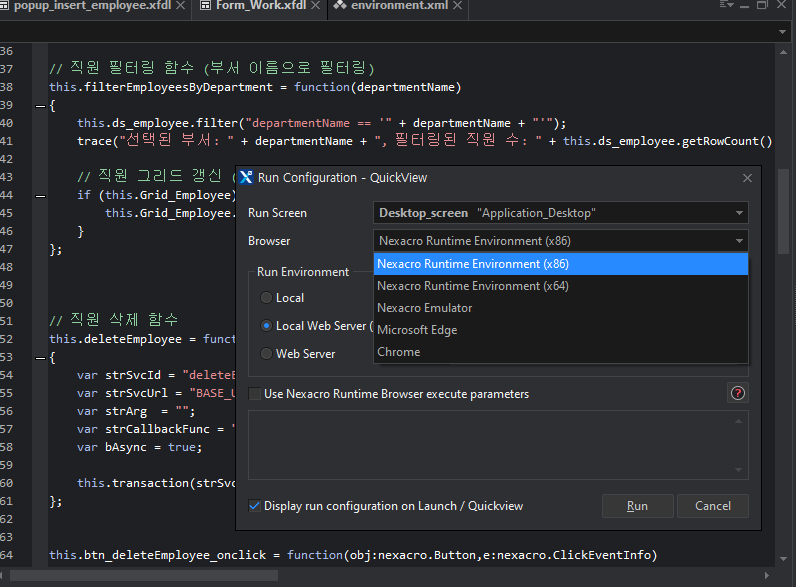

# 😀넥사크로 맛보기😀

## 넥사크로란?

- 자바스크립트 기반 라이브러리를 묶은 프론트엔드 개발용 프레임워크
- GUI(Graphical User Interface)로 구성할 수 있으며 동적으로 처리할 각종 이벤트를 자바스크립트로 코딩이 가능
- 크로스 플랫폼 지원 - 웹, 모바일, 데스크톱 등 다양한 환경에서 동작
- 한국어 지원 및 국내 기술 지원이 용이

실제로 넥사크로를 구동할 때 여러 환경에서 실행할 수 있었다.

UI 기반의 컴포넌트 구성으로 익숙해지면 개발 속도가 정말 빠를 것 같다. 

다음 좌측과 하단에 보면 DataSet이라는 자료구조가 있는데 이 자료구조를 통해 데이터를 관리한다. 

또한 통신은 transaction이라는 넥사크로의 메서드를 이용한다.

## 구현 결과

### 아키텍처

### ERD

### BackEnd 설정

이 부분에서 애를 많이 먹었다. 

넥사크로는 기본적으로 DataSet이라는 구조를 기반으로 통신을 하며 백엔드에서는 넥사크로가 데이터를 읽을 수 있는 형식으로 반환해줘야했다. 

tobesoft 에서 관련 라이브러리를 설치 

체험판 라이센스 발급 

스프링에 jar파일과 라이센스.xml을 같은 디렉터리에 위치하고 빌드를 진행함으로 설정을 완료 

부서 데이터 조회 예시 

## 완성 본

### 회고

실제로 RestFull한 통신이 가능한지는 잘 모르겠다. 

또한 넥사크로에서 스프링으로 데이터를 넘겨줄 때 데이터셋 객체를 넘기고 스프링에서는 @DataSet 에너테이션을 이용해 값을 받을 수 있는 것 같은데 잘 안되서 쿼리파라미터로 모두 넘겨서 처리해줬다. 

좋은 설계가 아니란건 알지만 해당 부분에 대해서는 더욱 자세한 학습이 필요하다.